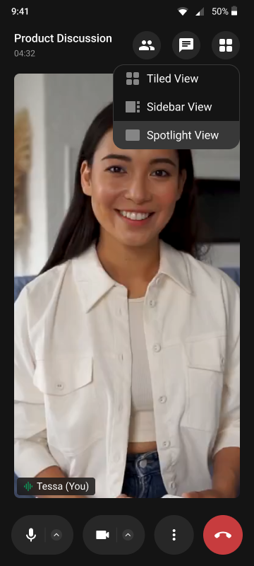

<p align="center">
  
</p>

# CometChat Calls SDK for Android

The CometChat Calls SDK enables real-time voice and video calling capabilities in your Android application. Built on top of WebRTC, it provides a complete calling solution with built-in UI components and extensive customization options.

<p align="center">
  &nbsp;&nbsp;
  &nbsp;&nbsp;
  
</p>


## Features

- 1:1 and group voice/video calls
- Built-in calling UI with customizable themes
- Screen sharing
- Call recording
- Active speaker detection

## Installation

Add the repository and dependency to your project:

```kotlin
// settings.gradle.kts
dependencyResolutionManagement {
    repositories {
        google()
        mavenCentral()
        maven { url = uri("https://dl.cloudsmith.io/public/cometchat/cometchat/maven/") }
    }
}

// app/build.gradle.kts
dependencies {
    implementation("com.cometchat:calls-sdk-android:5.0.0-beta.2")
}
```

For the complete setup guide, refer to our [official documentation](https://www.cometchat.com/docs/calls/android/overview).

## Help and Support

For issues running the project or integrating with our UI Kits, consult our [documentation](https://www.cometchat.com/docs/calls/android/overview) or create a [support ticket](https://help.cometchat.com/hc/en-us) or seek real-time support via the [CometChat Dashboard](https://app.cometchat.com/).
